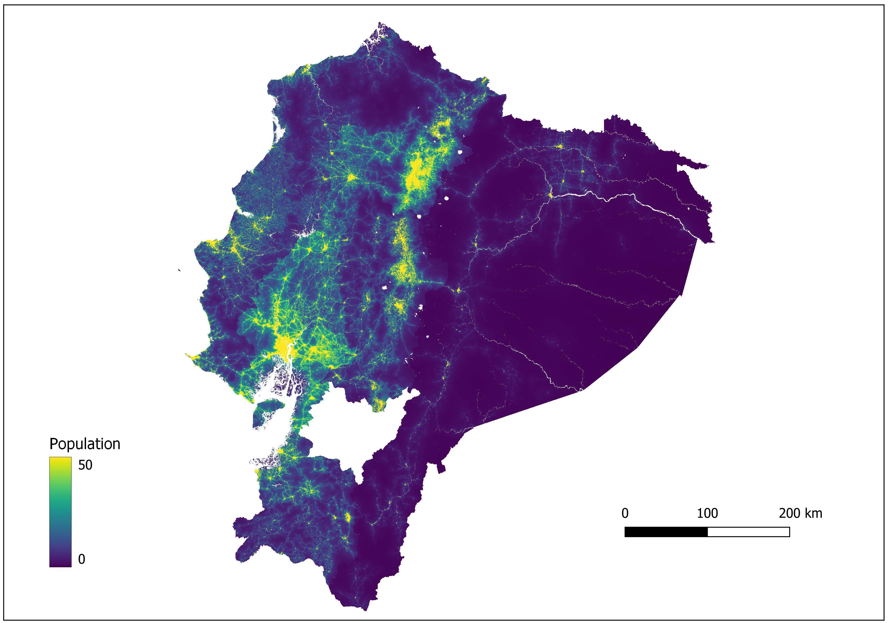

## popRF: Random Forest-informed Population Disaggregation R package

[](https://zenodo.org/badge/latestdoi/369354393)

High resolution, recent data on human population distributions are important for measuring impacts of population growth, monitoring human-environment interactions and for planning and policy development. Many methods are used to disaggregate census data and predict population densities for finer scale, gridded population data sets.  
`popRF` is a population modelling R package utilizing Random Forests to inform a dasymetric redistribution of census-based population count data. A description of using Random Forests machine learning method  in `popRF` is described in [Stevens et al](https://doi.org/10.1371/journal.pone.0107042). 

### Installation
The `popRF` package can be installed directly from Github.

``` r
install.packages("devtools")
devtools::install_github("wpgp/popRF")
```

### Demo 

The `popRF` package has a demo function `popRFdemo` to generate a population layer
using the [WorldPop](https://www.worldpop.org) geospatial covariates and
subnational census-based population estimates for 230 countries. 
All necessary covariates will be downloaded and used to disaggregat population.
All input datasets use a geographical coordinate system (GCS) with WGS 1984
datum (EPSG:4326) in Geotiff format at a resolution of 3 arc-second
(0.00083333333 decimal degree, approximately 100m at the equator).

The following script will produce a population layer for Nepal (NPL) using 4 cores.

``` r
library("popRF")

popRFdemo(project_dir="/home/user/demo",
          country="NPL", 
          cores=4)
 
```

### Basic Usage

``` r
library("popRF")

# Specifying a name of the file from which the unique area ID and corresponding 
# population values are to be read from. The file should contain two columns 
# comma-separated with the value of administrative ID and population without
# columns names. If it does not contain an absolute path, the file name is 
# relative to the current working directory

pop_table <- list("NPL"="/user/npl_population.csv")


# Specifying a nested list of named list(s), i.e. where each element of the
# first list is a named list object with atomic elements. The name of
# each named list corresponds to the 3-letter ISO code of a specified
# country. The elements within each named list define the specified
# input covariates to be used in the random forest model, i.e. the name
# of the covariates and the corresponding, if applicable and local, path
# to them. If the path is not a full path, it is assumed to be relative
# to the current working directory

input_cov <- list(
                  "NPL"= list(
                             "cov1" = "covariate1.tif",
                             "cov2" = "covariate2.tif"
                     )
                  )
                     
# Specifying a named list where each element of the list defines the
# path to the input mastergrid(s), i.e. the template gridded raster(s)
# that contains the unique area IDs as their value. The name(s)
# corresponds to the 3-letter ISO code(s) of a specified country(ies).
# Each corresponding element defines the path to the mastergrid(s). If
# the path is local and not a full path, it is assumed to be relative to
# the current working directory                     

input_mastergrid <- list("NPL" = "npl_mastergrid.tif")

# Specifying a named list where each element of the list defines the path
# to the input country-specific watermask. The name corresponds to the
# 3-letter ISO code of a specified country. Each corresponding element
# defines the path to the watermask, i.e. the binary raster that
# delineates the presence of water (1) and non-water (0), that is used
# to mask out areas from modelling. If the path is local and not a full
# path, it is assumed to be relative to the current working directory.


input_watermask <- list("NPL" = "npl_watermask.tif")

# Specifying a named list where each element of the list defines the path
# to the input raster(s) containing the pixel area. The name corresponds
# to the 3-letter ISO code of a specified country. Each corresponding
# element defines the path to the raster whose values indicate the area
# of each unprojected (WGS84) pixel. If the path is local and not a full
# path, it is assumed to be relative to the current working directory.

input_px_area <- list("NPL" = "npl_px_area.tif")

# Running a model

res <- popRF(pop=pop_table,
             cov=input_cov,
             mastergrid=input_mastergrid,
             watermask=input_watermask,
             px_area=input_px_area,
             output_dir="/user/output",
             cores=4)

# Plot populataion raster
plot(res$pop)

# Plot Error via Trees
plot(res$popfit)
```



### Outputs

Population raster layer in GeoTiff format.

## Contributions

Contributions are welcome. Please raise or respond to an issue, or create a new
branch to develop a feature/modification and submit a pull request.

## Acknowledgements

``` r
#> citation("popRF")

#> To cite popRF in publications use:
#> 
#> Bondarenko M., Nieves J.J., Forrest R.S., Andrea E.G., Jochem C., Kerr D., and Sorichetta A. (2021): popRF: Random Forest-informed Population
#> Disaggregation R package, _Comprehensive R Archive Network (CRAN)_, url:https://cran.r-project.org/package=popRF, DOI:10.5258/SOTON/WP00715.
#>
#> A BibTeX entry for LaTeX users is
#> 
#> @Manual{,
#>  title = {popRF: Random Forest-informed Population Disaggregation R package.},
#>  author = {Maksym Bondarenko and Jeremiah J Nieves and Forrest R. Stevens and Andrea E. Gaughan and Chris Jochem and David Kerr and Alessandro Sorichetta},
#>  year = {2021},
#>  journal = {Comprehensive R Archive Network (CRAN)},
#>  url = {https://cran.r-project.org/package=popRF},
#>  doi = {10.5258/SOTON/WP00715},
#>  language = {English},
#> }
  
```

### License
<a href='COPYING' target='_blank'>GNU General Public License v3.0 (GNU GPLv3)]</a>